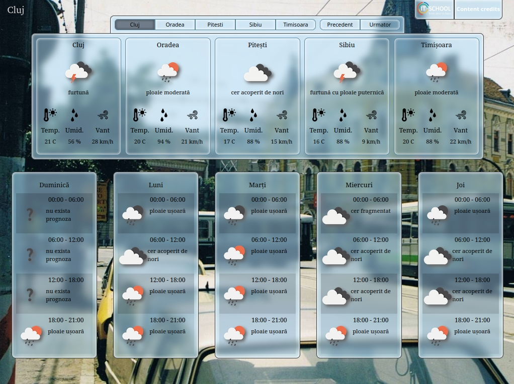

Simple weather app made for homework.
The web page is made in HTML, CSS and vanilla JavaScript (no frameworks used).
For getting the weather data, [openweathermap.org](https://openweathermap.org/) is used as an endpoint. The webpage connects to openweathermap trough JavaScript's fetch() built-in function.

You can see the final result [hosted on Netlify](https://aciuc-weather.netlify.app)

